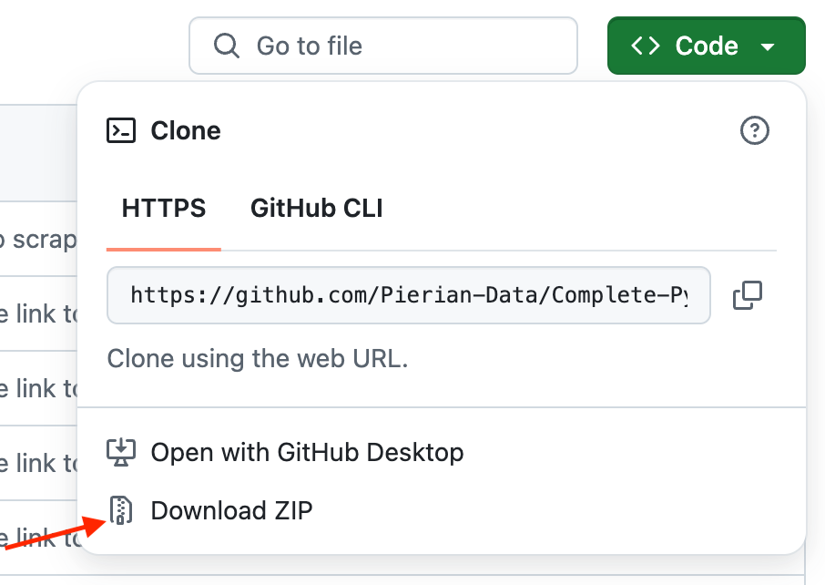

# FAQs from the bootcamp course

## Quick Note on how to download the Course Material
Github recently changed its layout. To download the course material navigate to https://github.com/Pierian-Data/Complete-Python-3-Bootcamp.

Click "Code" and choose "Download ZIP"

## Numbers - FAQ

1. What's the difference between floating point and an integer?

An integer has no decimals in it, a floating point number can display digits past the decimal point.

2. Why doesn't 0.1+0.2-0.3 equal 0.0 ?

This has to do with floating point accuracy and computer's abilities to represent numbers in memory. For a full breakdown, check out: https://docs.python.org/2/tutorial/floatingpoint.html

## Strings -FAQ

1. Are strings mutable?

Strings are not mutable! (meaning you can't use indexing to change individual elements of a string)

2. How do I create comments in my code?

You can use the hashtag # to create comments in your code

## Print Formatting FAQS

1) I imported print from the __future__ module, now print isn't working. What happened?

This is because once you import from the __future__ module in Python 2.7, a print statement will no longer work, and print must then use a print() function. Meaning that you must use

>print('Whatever you were going to print')

or if you are using some formatting:

>print('This is a string with an {p}'.format(p='insert'))

The __future__ module allows you to use Python3 functionality in a Python2 environment, but some functionality is overwritten (such as the print statement, or classic division when you import division).

Since we are using Jupyter Notebooks, once you so the import, all cells will require the use if the print() function. You will have to restart Python or start a new notebook to regain the old functionality back.

**HERE IS AN AWESOME SOURCE FOR PRINT FORMATTING:**

https://pyformat.info/